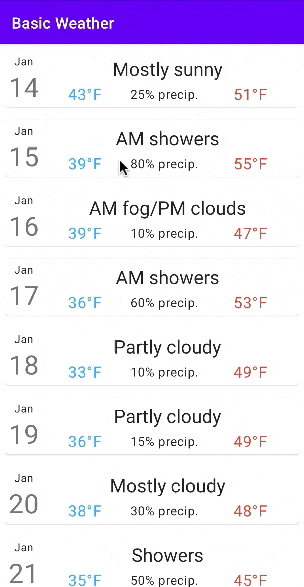

# Assignment 1
**Due by 11:59pm on Wednesday, 1/31/2024**  
**Demo due by 11:59pm on Monday, 2/19/2024**

In this assignment, we'll get our toes wet in the pond of Android development by writing the beginnings of a simple weather app.  To do this, we'll start working with `RecyclerView`, which is an effective way to write efficient and scalable dynamic list-based user interfaces.  The parts of the assignment are outlined below.  This screen capture depicts roughly what the app should look like and how it should behave:

**Note that you don't have to exactly match the styling depicted in the screen capture here, especially the top app bar, which you can omit for this assignment.**

## 1. Familiarize yourself with Ed Discussion

This first part of this assignment is simple and doesn't involve coding.  Just visit our course forum on Ed Discussion and familiarize yourself with that platform.  You can find a link to our Ed forum both on the course website and in Canvas within the course navigation bar for CS 492/599.  Most of you should already be automatically enrolled in our course on Ed with your @oregonstate.edu email address.  However, if you have trouble connecting to our course forum there, please catch up with me after lecture or drop into my office hours, and I’ll make sure you’re able to log in.

We'll be using Ed as our main communication platform for the course.  Ed is essentially a StackOverflow-style Q&A forum, where you can ask questions and answer your classmates’ questions.  Please use Ed exclusively for questions you have about the course, so all our course Q&A can live in one central, easily accessible place.  I (Hess) and the TAs will be on Ed, just like you and your fellow students, so you can feel confident about getting the answers you need there.

I strongly encourage you to also spend time answering your fellow classmates’ questions on Ed. This will not only enable everyone to get help quickly, but it will also help you improve your understanding of the material, since teaching someone else is the best way to learn something.  As an extra incentive to answer questions on Ed, extra credit will be awarded to the most active Ed participants at the end of the course (based on analytics tracked by Ed).

## 2. Write a basic app to display dummy weather data

This repository contains an initial template for an Android app.  Currently, the app contains one extremely basic "hello world" activity.  Your job in this assignment is to modify this activity to create the beginnings of a basic weather app.  Here's what you need to do to accomplish this:

  * Create a custom Kotlin class to represent the weather forecast for a specific day or other period of time.  This class should have properties to represent the following forecast data (at a minimum; feel free to include more forecast data if you want):
    * The date/time associated with the forecast being represented.
    * The high and low temperatures for the forecast period.
    * The probability of precipitation associated with the forecast period (e.g. 75%).
    * A short description of the weather associated with the forecast period (e.g. "Sunny and warm").
    * A longer version of the weather description (e.g. "Cloudless and generally warm, with a high of 75F and a low of 57F.  Some high clouds late in the day.").

  * Allocate a list of 10-15 objects of the custom class you just created, and initialize it with some hard-coded, dummy weather data.

  * Use the `RecyclerView` framework to display the entire array of forecast data as a scrollable vertical list of cards.  To accomplish this, you'll need to do the following:
    * Add a `RecyclerView` widget to the main activity's layout.
    * Create a new layout defining a card that depicts a single forecast element in your array.  This card should display all of the information contained in the forecast object *except the long version of the forecast*, which we'll use later.  Try to make your card look as good as you can.  For example, add margins, borders, and padding as appropriate to create space inside and around the card and its elements, and try to organize the information displayed in each card in an intuitive and visually appealing way.  You should try to follow [Material Design guidelines](https://m3.material.io/components/cards/overview) when implementing your card, e.g. by using [`MaterialCardView`](https://github.com/material-components/material-components-android/blob/master/docs/components/Card.md).
    * Write a class that extends `RecyclerView.Adapter`.  Within this class, you will:
      * Implement an inner class that extends `RecyclerView.ViewHolder`.  Objects of this class will represent individual items in your forecast list.
      * Write methods to bind weather forecast data from your array to your view holder objects.  These methods will be used to make sure the list stays up to date as the user scrolls.
    * Within your main activity's `onCreate()` method, create a new layout manager and connect it to the `RecyclerView`.  Then, create a new object of your adapter class and attach that to the `RecyclerView`.  Make sure to store your dummy weather forecast data in the adapter.

  Importantly, the app you write should not have any extraneous components.  For example, you should not include a text entry box and/or a button like we did in the app we wrote in lecture, since the user will not have to provide any input for this app.

## 3. Handle user long presses on items in the weather list

Finally, you should add functionality that handles long presses on weather forecast elements in your `RecyclerView` list.  Specifically, modify your main activity and/or adapter class so that, when the user performs a long press (i.e. a long click) on one of the weather forecast elements in your list, a [`Snackbar`](https://developer.android.com/training/snackbar) is displayed that contains the longer version of the forecast description corresponding to the list item that was clicked.  Note that to do this, you'll have to listen for long presses on the `RecyclerView` view holders themselves (specifically to the `View` associated with the view holder).  You can attach a long press listener to these elements in much the same way we attached a regular click listener to a button in lecture.

## CS 599 only: Use `ConstraintLayout` within your cards

This assignment's challenge for students in the grad section of the course should be fairly straightforward and is intended to help you get your feet wet implementing code based on the Android documentation.  Specifically, if you're in the grad section of the course, you have one additional requirement for this assignment, which is to use [`ConstraintLayout`](https://developer.android.com/reference/androidx/constraintlayout/widget/ConstraintLayout) to implement a flexible, responsive layout for the contents of the card elements in your weather forecast list.  You should use only `ConstraintLayout` to lay out your card elements and no other layout class, like `LinearLayout`, `RelativeLayout`, etc.

Follow the Android Developers documentation to learn how to use `ConstraintLayout`.  To implement your `ConstraintLayout`, you may use Android Studio's [drag-and-drop-based layout editor](https://developer.android.com/develop/ui/views/layout/constraint-layout) or you may [manually implement constraints](https://developer.android.com/reference/androidx/constraintlayout/widget/ConstraintLayout) by writing raw XML code.

## Submission

We'll be using GitHub Classroom for this assignment, and you will submit your assignment via GitHub.  Make sure your completed files are committed and pushed by the assignment's deadline to the main branch of the GitHub repo that was created for you by GitHub Classroom.  A good way to check whether your files are safely submitted is to look at the main branch your assignment repo on the github.com website (i.e. https://github.com/osu-cs492-599-w24/assignment-1-YourGitHubUsername/). If your changes show up there, you can consider your files submitted.

## Grading criteria

The base assignment is worth 100 total points, broken down as follows:

* 20 points: Successfully logged in to the CS 492/599 forum on Ed Discussion.
  * There’s no need to post anything, just log in.  This will be verified based on whether you are marked as “active” in Ed’s analytics at the assignment deadline.
  * This part of the grade is all-or-nothing.  You will earn 0/20 points if you don’t log in.

* 50 points: Correctly uses the `RecyclerView` framework to display dummy weather forecast data on screen in a scrollable list of visually appealing cards.
  * 5 points: Uses custom Kotlin class to create a collection of at least 10 days worth of dummy weather data containing attributes described above.
  * 10 points: Correctly stores and manages dummy weather data for the `RecyclerView` in a `RecyclerView.Adapter` class.
  * 20 points: Implements a visually appealing card-based layout to represent the appearance of items in the list.
  * 10 points: Correctly creates `RecyclerView.ViewHolder` objects and binds data from the `RecyclerView.Adapter` into them as the user scrolls through the list.
  * 5 points: Correctly incorporates the `RecyclerView` into the app's main activity.
    * This includes assigning a `LayoutManager` to the `RecyclerView`.

* 10 points: Interface does not contain extraneous elements (e.g. buttons, text entry boxes, etc.).

* 20 points: Successfully displays the correct detailed weather forecast in a `Snackbar` when the user long presses on forecast items in the list, as described above.

In addition, the assignment for the grad section of the course has the following additional grading criteria, making the grad section's version of the assignment worth 125 points total:

* 25 points: Uses `ConstraintLayout` to implement a flexible, responsive layout for the cards in the weather list.
  * May only use `ConstraintLayout` to lay out the card elements and no other layout classes like `LinearLayout`.
  * Layout must be well organized and visually appealing.
